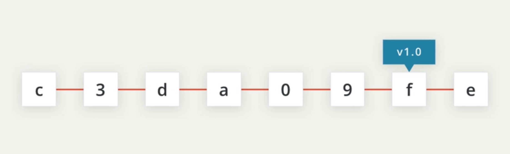

# 2. Tagging
- `Tags` let you point out particular commits to make them stand out from others and we can label the `tag` with something like `v1.0`. etc.
- A `tag` stays locked to the commit it was assigned to

<p align="center">
  
</p>

## Where Are We?
- First, `cd` into the `new-git-project` directory.
- Run `git log --oneline` to see our recent commits.

## Git Tag Command
- Pay attention to what's shown (just the `SHA` and the `commit message`)
- The command we'll be using to interact with the repository's `tags` is the `git tag` command:
```
git tag -a <tag name>
```
- Running this will open your code editor and wait for you to supply a message for the tag. How about the message `Ready for content`?
  - CAREFUL: In the command above (`git tag -a v1.0`) the `-a` flag is used. This flag tells `Git` to create an `annotated flag`. If you don't provide the `flag` (i.e. `git tag v1.0`) then it'll create what's called a `lightweight tag`.
  - `Annotated tags` are recommended because they include a lot of extra information such as:
    - the person who made the tag
    - the date the tag was made
    - a message for the tag
  - Because of this, you should always use `annotated tags`.

  - TIP: If the message for the tag you're writing is short and you don't want to wait for your code editor to open up to type it out, you can pass your message directly on the command line with the `-m` flag:
  ```
  git tag -a v1.0 -m"Ready for content"
  ```

## Verify Tag
- To know that a `tag` was actually added to the project, type out just `git tag`, it will display all tags that are in the repository.
- To actually see where a `tag` is inside the repository, we can use `git log`.

## Git Log's --decorate Flag
- The `--decorate` flag will show us some details that are hidden from the default view.
- Try running 
```
git log --decorate
```
  - 💡 `--decorate` Flag Changes in `Git 2.13` 💡
    In the 2.13 update to `Git`, the log command has changed to automatically enable the `--decorate` flag. This means that you do not need to include the `--decorate` flag in your command, since it is automatically included, anyway! So the following commands result in the exact same output:
    ```
    git log --decorate
    git log
    ```
    Check out the [2.13 release notes](https://github.com/git/git/blob/v2.13.0/Documentation/RelNotes/2.13.0.txt#L176-L177).
- See how it says `tag: v1.0`? That's the `tag`! Remember that `tags` are associated with a specific commit. This is why the `tag` is on the same line as the commit's `SHA`.
  - `HEAD -> master`?
    Did you notice that, in addition to the tag information being displayed in the log, the `--decorate` also revealed `HEAD -> master`? That's information about a branch.

## Deleting A Tag
- What if you accidentally misspelled something in the `tag`'s message, or mistyped the actual `tag` name (Ex. `v0.1` instead of `v1.0`). The easiest way to fix this is just to `delete` the `tag` and make a new one.
- A `Git tag` can be deleted with the `-d` flag (for delete!) and the name of the tag:
```
git tag -d <tag name>
```

- QUIZ QUESTION: By default, a `Git tag` will not appear in a `log`. What `flag` must be used to display the `tag` information in the output of `git log`?
  1. --show-tags
  2. --tags
  3. --display-all
  4. --decorate
  ```
  Correct Answer: Option 4
  ```
- QUIZ QUESTION: Which of the following will `delete` the tag `v-1`?
  1. git tag --delete v-1
  2. git remove v-1
  3. git tag -d v-1
  4. git delete v-1
  ```
  Correct Answer: Options 1 and 3
  Hint: Remember that it's helpful to think that the -d flag is short for delete.
  ```

## Adding A Tag To A Past Commit
- Running `git tag -a v1.0` will tag the most recent commit.
- If you want to `tag a commit that occurred farther back` in the repo's history, all you have to do is provide the `SHA` of the `commit` you want to tag!
```
git tag -a <tag name> <commit SHA> -m"<message>"
```

- Tag Older Commit? Using the following `git log --oneline` information, what command would you run to give the commit with the message `style page header` a tag of `beta`?
  ```
  2a9e9f3 add breakpoint for large-sized screens
  137a0bd add breakpoint for medium-sized screens
  c5ee895 add space around page edge
  b552fa5 style page header
  f8c87c7 convert social links from text to images
  ```
  ```
  Correct Answer:
  git tag -a beta b552fa5 -m"add tag to the commit b552fa5"
  ```

## Recap
- The `git tag` command is used to add a marker on a specific commit. The tag does not move around as new commits are added.
- Running `git tag -a <tag name>` will:
  - Add a tag to the most recent commit
  - Add a tag to a specific commit if a SHA is passed

## Further Research
- [Git Basics - Tagging](https://git-scm.com/book/en/v2/Git-Basics-Tagging) from the Git Book
- [Git Tag](https://git-scm.com/docs/git-tag) from the Git Docs